# 电商后台管理系统（前端部分）

### 接口API见 [后端部分](https://github.com/uyingchuan/vueShop-api-server)

## 功能
> 用户管理，权限管理，商品管理，订单管理，数据统计

## 技术选型
### 前端技术栈

- Vue
- Vue-router
- Element-UI
- Axios
- Echarts

### 后端技术栈

- NodeJS
- Express
- Jwt
- Myspl
- Sequelize


### 项目预览
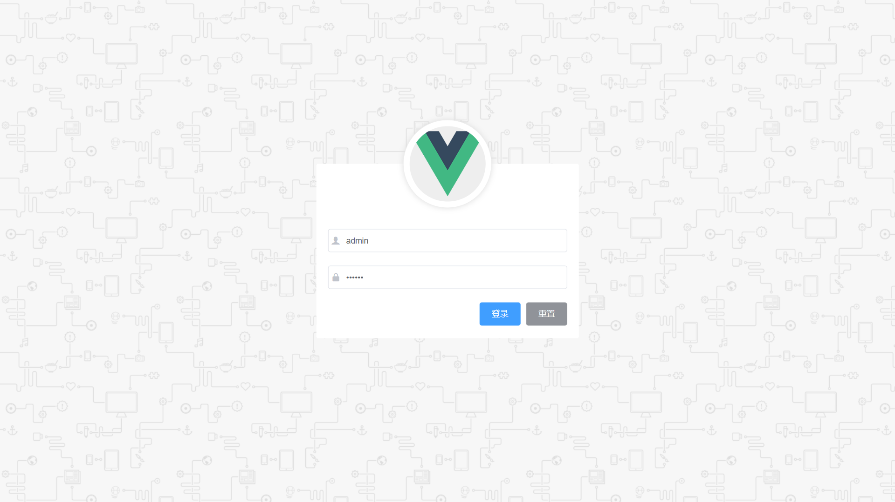

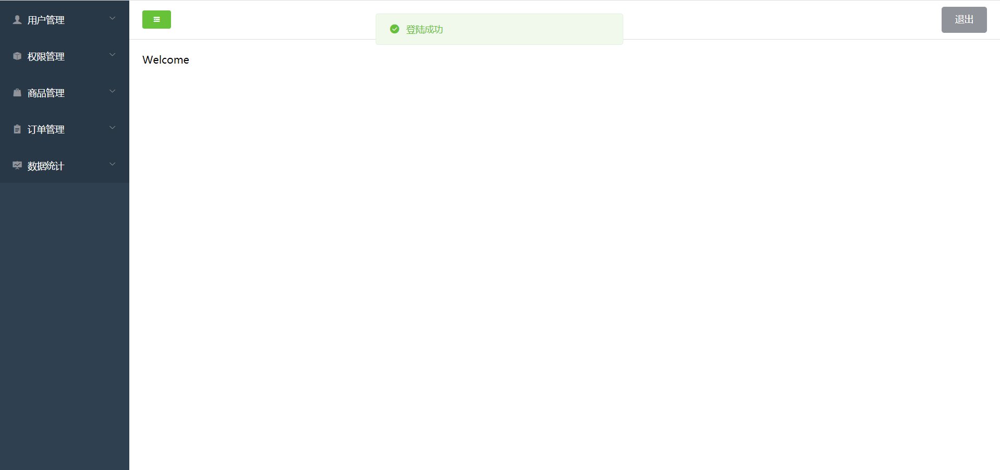

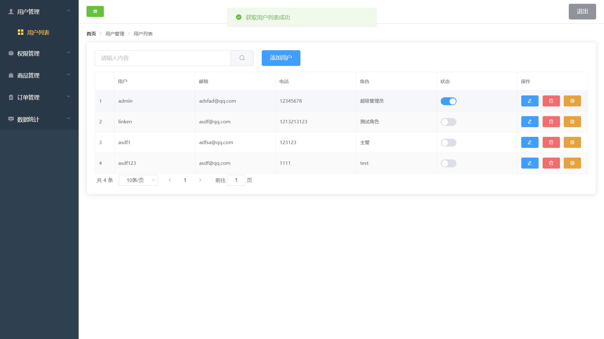

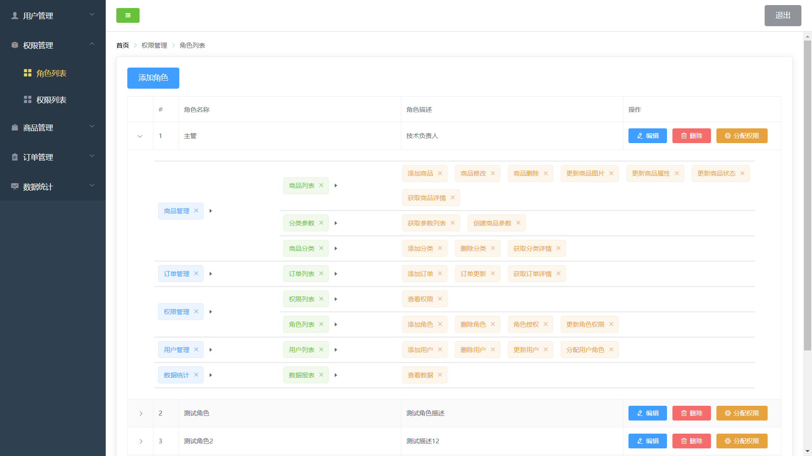

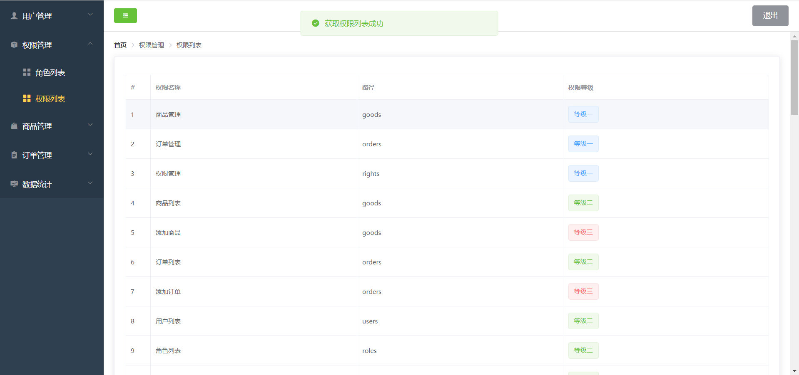

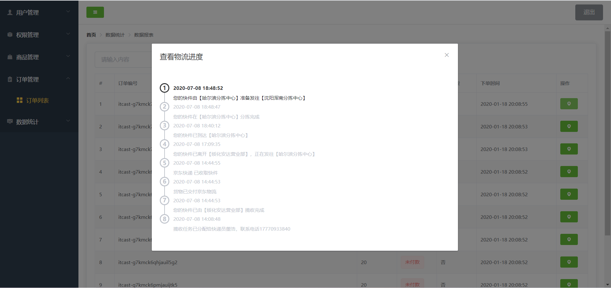

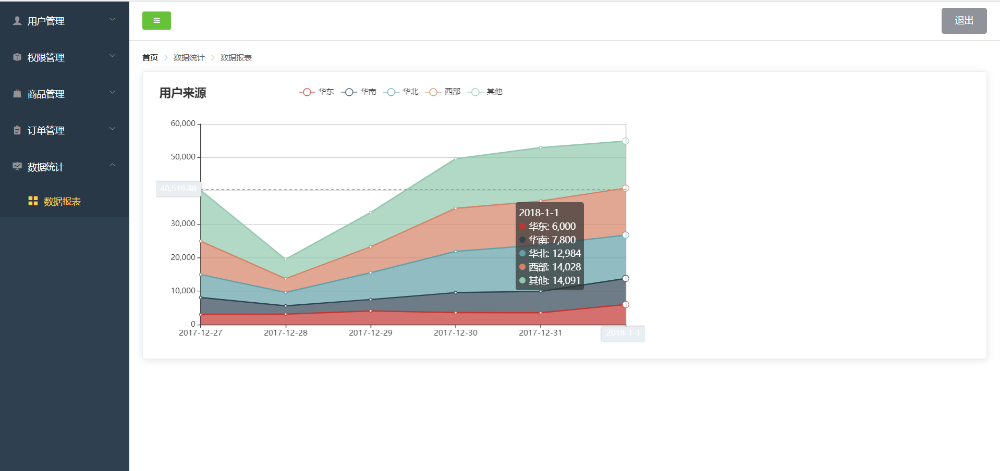

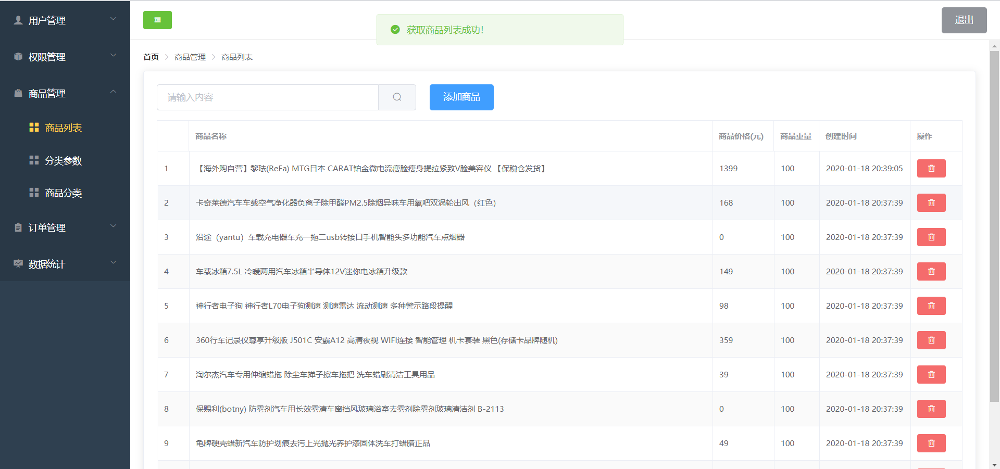

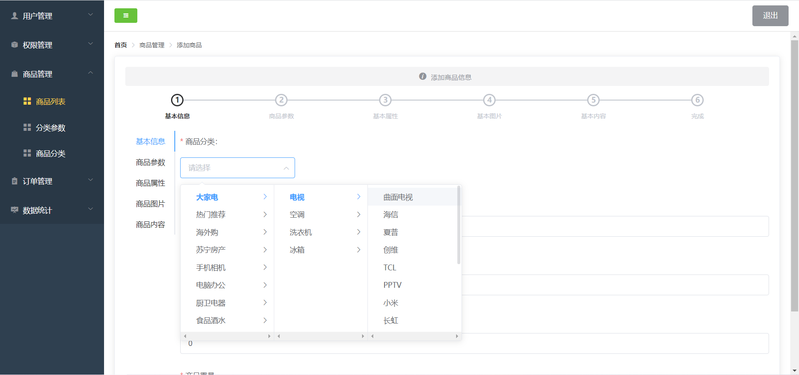

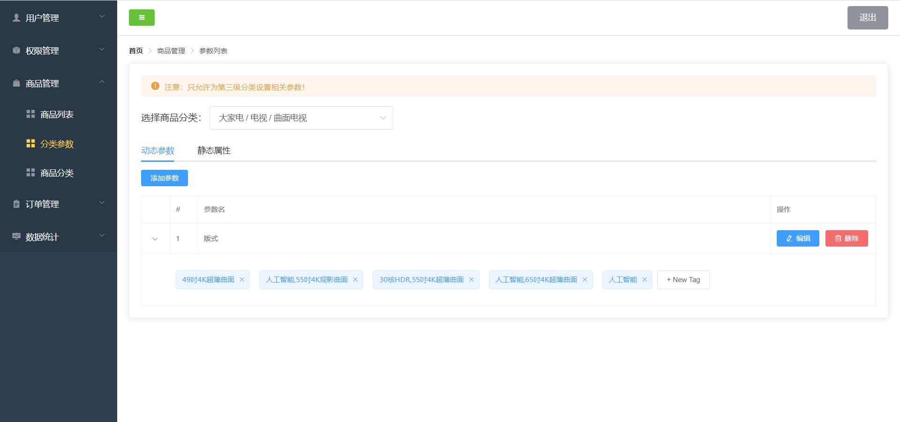

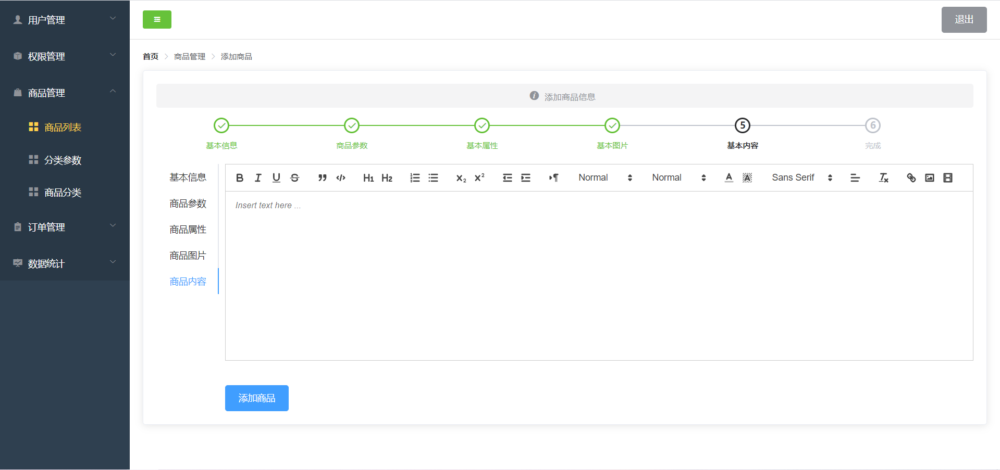

### 安装与使用
```bash
npm install
npm run serve
```
